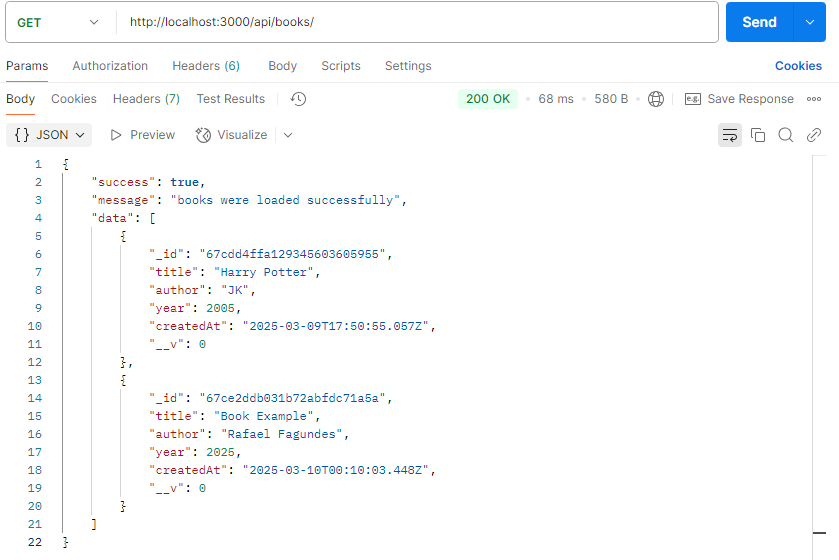
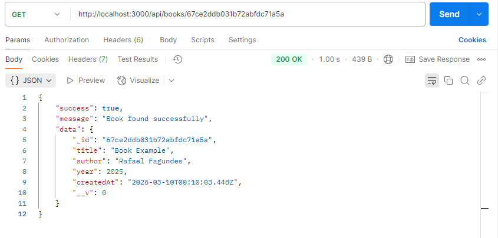
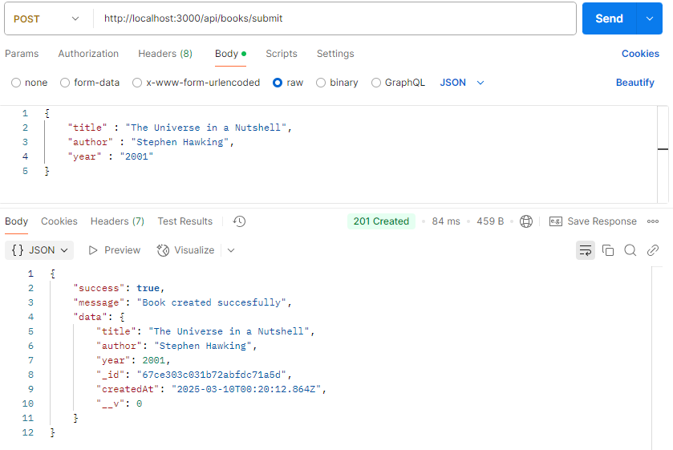

# Book Store

[Leia em português]()

## Description

The project **Book Store** is a REST API web application for managing online libraries, it was made using node, express, mongoDb, postman and nodemon for its development. It allows the user:
* Navigate among book names
* Look at a specific one by id
* Create books
* Delete books
* Update books
  ## Set Up
1. Clone repository:
   ```bash
   git clone https://github.com/devRafaelFagundes/book-store.git
   ```
3. Navigate to correct directory:
   ```bash
   cd book-store
   ```
4. Install dependencies:
   ```bash
   npm i
   ```
5. Start application:
   ```bash
   node server.js
   ```
## How to test

Even though you can access the data at the link "http://localhost:3000/api/books", you can't make any changes to the database, you need an **API TESTER** to do that, such as [**POSTMAN**](https://www.postman.com/). Simply create an account and a project, then you are finally ready for testing each route and messing with the database, speaking of routes, we can now go to the next topic. 

## API Routes

### Show all books
Endpoint: GET /api/books


### Show specific book
Endpoint: GET /api/books/:id


### Create a new book
Endpoint: POST /api/books/submit


### Delete a book

### Update a book
### Want to contribute?

made effortfully by [devRafaelFagundes](https://github.com/devRafaelFagundes)
