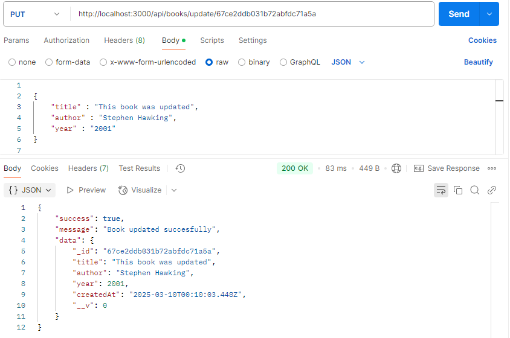

# Book Store

[Read in English](README.md)

## Descrição

O projeto **Book Store** é uma aplicação web REST API para gerenciar bibliotecas online, desenvolvido usando node, express, mongoDb, postman e nodemon. Ele permite ao usuário:
* Navegar pelos nomes dos livros
* Visualizar um livro específico pelo id
* Criar livros
* Deletar livros
* Atualizar livros

## Configuração

1. Clone o repositório:
   ```bash
   git clone https://github.com/devRafaelFagundes/book-store.git
   ```

2. Navegue para o diretório correto:
   ```bash
   cd book-store
   ```

3. Instale as dependências:
   ```bash
   npm i
   ```

4. Inicie a aplicação:
   ```bash
   node server.js
   ```

## Como testar

Embora você possa acessar os dados no link "http://localhost:3000/api/books", não é possível fazer alterações no banco de dados diretamente pelo navegador; você precisará de um **TESTADOR DE API**, como o [**POSTMAN**](https://www.postman.com/), para isso.

## Rotas da API

### Mostrar todos os livros
Endpoint: GET /api/books


### Mostrar um livro específico
Endpoint: GET /api/books/:id


### Criar um novo livro
Endpoint: POST /api/books/submit


### Deletar um livro
Endpoint: DELETE /api/books/delete/:id


### Atualizar um livro
Endpoint: PUT /api/books/update/:id



### Quer contribuir?

Como é um projeto pequeno, não espero uma comunidade muito ativa, mas você pode me ajudar dando dicas de melhorias no meu código, ideias ou qualquer coisa que ache útil!

Feito com muito esforço por [devRafaelFagundes](https://github.com/devRafaelFagundes)